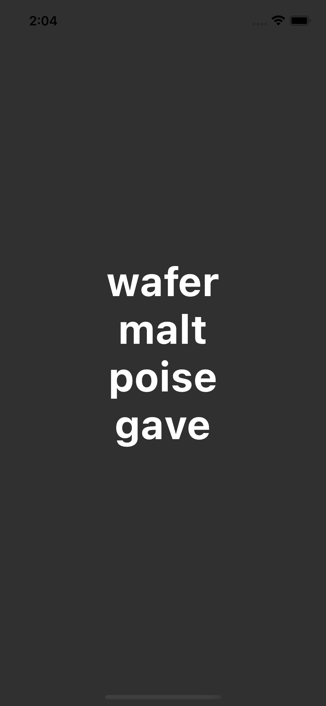

# Four Words

A passphrase generator written in Flutter. Under development. Currently only uses [EFF Short Wordlist for Passphrases #1](https://www.eff.org/document/eff-short-wordlist-passphrases-1). Web version hosted at: [fourwords.raywalz.com](https://fourwords.raywalz.com)

## TO-DO:
- Generate random words on load
- Convert to [Random.secure()](https://api.dart.dev/stable/2.10.4/dart-math/Random/Random.secure.html)
- Add option to use [EFF Large Wordlist for Passphrases](https://www.eff.org/document/passphrase-wordlists)
- Add option to add a random number.
- Add option to add a random symbol.
- Add option to randomly capitalize one of the words.

